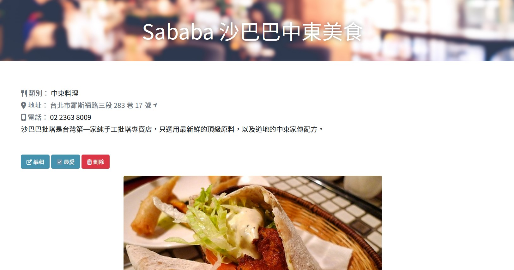
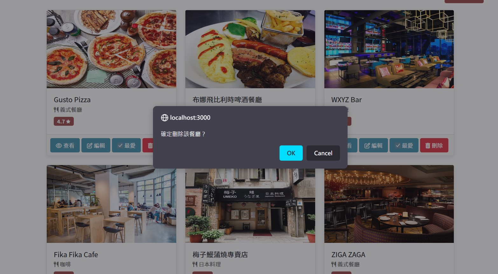

# My Restaurant List 2.0 我的餐廳清單 2.0

## 💡 Overview 介紹

專屬於你的餐廳清單！使用者可以瀏覽餐廳、查看詳細資訊、並新增、編輯、刪除餐廳資訊。

### ⚙️ Features 功能

- 在首頁可查看所有餐廳的資訊，包含餐廳名稱、類別及評分
- 點擊餐廳可看見該餐廳的詳細資訊，例如地址、電話、餐廳描述等資訊
- 點擊餐廳地址可打開該餐廳的 Google 地圖頁面
- 在首頁，使用者可用中文、英文以及類別名稱搜尋餐廳
- 若搜尋輸入為空白，會顯示「請輸入正確關鍵字」提示使用者
- 若查無符合關鍵字的結果，會隨機推薦三個餐廳給使用者

#### 2.0 版本新增功能
- 點擊「新增餐廳」可新增餐廳資訊，包含類別、圖片、文字描述等等
- 點擊「編輯」按鈕可進入編輯頁面，編輯餐廳資訊
- 使用者可在編輯頁面將餐廳加入最愛
- 點擊「刪除」可將餐廳資訊刪除，並在刪除前跳出確認提示
- 可在首頁選擇餐廳排序方式，包含：A-Z、類別、評分、已加入最愛等等

### 👀 Screenshots 頁面截圖
#### 首頁

#### 顯示餐廳頁面

#### 新增餐廳頁面

#### 編輯餐廳頁面

#### 刪除前顯示提示


## 🚀 Getting Started 開始使用

⚠️ **請先確認電腦中已安裝 node.js 與 npm！**

1. 將專案 clone 到本地：

```bash
$ git clone "https://github.com/KellyCHI22/restaurant_list.git"
```
2. 在本地開啟之後，透過終端機進入資料夾，輸入：

```bash
$ npm install
```

3. 安裝完畢後，輸入以下指令產生種子資料：

```bash
$ npm run seed
```
若看見以下訊息，表示種子資料已產生完畢。
```bash
restaurantSeeder done!
```

4. 種子資料產生後，繼續輸入：

```bash
$ npm run start
```

5. 若看見此訊息代表程式已順利運行，打開瀏覽器輸入網址：`http://localhost:3000` 即可進入網站

```bash
Express is listening on http://localhost:3000
```

6. 若要暫停使用，可在終端機入入以下指令：

```bash
ctrl + c
```
## ✅ What I learned 學習重點
* 用 Express 建立一個簡單的網路應用程式
* 完成 CRUD 功能與路由設計
* 建立 Express & MongoDB 的連線
* 建立 seeder 檔案，載入種子資料
* 透過 body-parser 從 POST 方法的路由中取得資料
* 運用 Express.Router，將路由從 app.js 分離獨立
* 正確使用 Mongoose 提供的 model 操作方法

## 💻 Technologies 開發環境與工具

- node.js 14.16.0
- express 4.16.4
- express-handlebars 3.0.0
- body-parser 1.20.1
- method-override 3.0.0
- mongoose 6.8.3
- nodemon 2.0.20
- dotenv 16.0.3
- Bootstrap 5.1.3
- Font-awesome 6.2.1